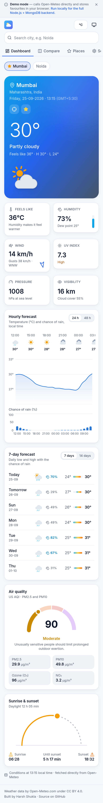
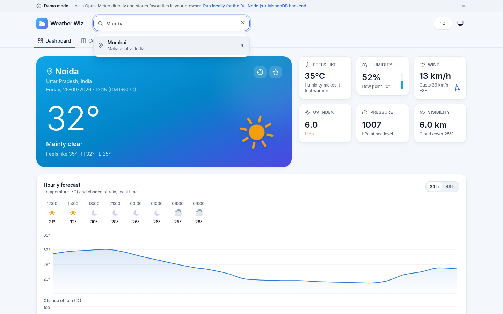
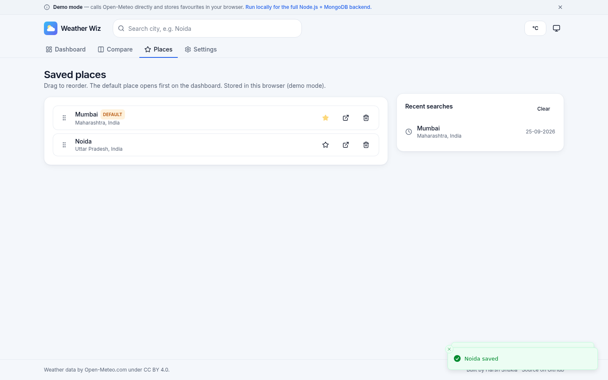
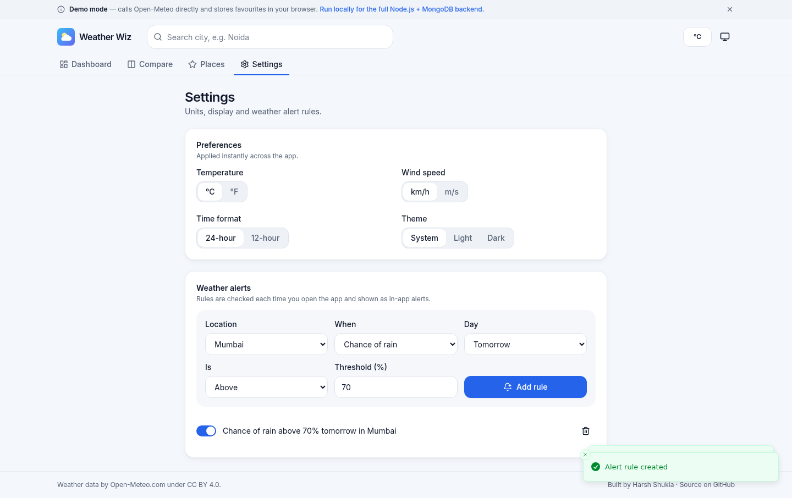
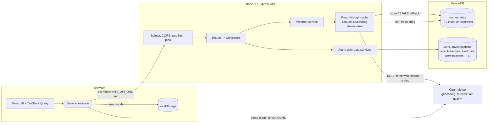

# Weather Wiz

A full-stack weather dashboard: live conditions, a 48-hour hourly chart, 14-day forecast, air quality, sunrise and sunset, city comparison and personal weather alerts. The React client talks to a Node.js/Express API that aggregates [Open-Meteo](https://open-meteo.com/), normalises the responses into a clean DTO and caches them in MongoDB with TTL indexes.

**Live demo:** https://harsh3851.github.io/Weather-Wiz/ (static demo mode, see [Two runtime modes](#two-runtime-modes))


| Dark theme                                        | Mobile (390 px)                            |
| ------------------------------------------------- | ------------------------------------------ |
|  |  |

| City search with autocomplete                        | Compare two cities                      |
| ---------------------------------------------------- | --------------------------------------- |
|  |  |

| Saved places (drag to reorder)         | Settings and alert rules             |
| -------------------------------------- | ------------------------------------ |
|  |  |

## Features

**Weather**

- Current conditions hero with subtle animated SVG weather icons (disabled under `prefers-reduced-motion`).
- Highlights: feels-like, humidity and dew point, wind speed, gusts and direction, UV index, pressure, visibility.
- Hourly temperature and chance-of-rain charts for the next 24 or 48 hours, with an accessible data table for screen readers.
- 7- or 14-day forecast with low-to-high range bars.
- US AQI gauge with category, health advice, PM2.5, PM10, ozone and NO₂.
- Sunrise and sunset arc showing the sun's position in the location's local time.
- Compare two cities side by side, with a daily-high chart and a difference table.
- City search with debounced autocomplete, recent searches and full keyboard navigation (WAI-ARIA combobox).
- "Use my location" through the Geolocation API, with clear messages when permission is denied or unavailable.
- Dates shown as DD-MM-YYYY; the default city is Noida, India.

**Accounts** (API mode)

- Register, sign in, sign out, and a one-click demo account seeded with sample places and an alert rule.
- Short-lived JWT access token held in memory; rotating refresh token in an httpOnly cookie with reuse detection.
- Saved places with drag-to-reorder (pointer and keyboard) and a default location.
- Preferences: °C/°F, km/h or m/s, 12/24-hour clock, and light, dark or system theme.
- Recent searches.
- Alert rules such as "chance of rain above 70% tomorrow in Noida", evaluated on request and shown as in-app alerts.

**Quality**

- Light and dark themes, responsive down to 360 px, loading skeletons, empty and error states, toasts.
- Accessible: labelled controls, visible focus, skip link, radio-group toggles, reduced-motion support.
- Graceful degradation: if the air-quality call fails the forecast still renders; if Open-Meteo is down the API serves the last cached forecast marked `STALE`.

## Architecture



**Caching.** Each upstream response is stored under a key built from the endpoint and coordinates rounded to two decimals (about 1 km), so nearby requests share an entry. An entry has two timestamps: `freshUntil` (10 minutes for forecasts, 30 minutes for air quality, 24 hours for geocoding) decides `HIT` versus `MISS`, and `expiresAt` (fresh window plus 6 hours) drives the MongoDB TTL index that deletes the document. Between the two, the entry is served as `STALE` only if Open-Meteo fails. Concurrent requests for the same key share one in-flight upstream call. The status is returned in the `X-Cache` header and in `meta.cache`.

**Upstream calls** use `fetch` with a per-attempt timeout (`AbortSignal.timeout`), exponential backoff with jitter on network errors, 5xx, 408 and 429, and no retries on other 4xx responses. Failures map to `502 UPSTREAM_ERROR` or `504 UPSTREAM_TIMEOUT`.

**Shared code.** `shared/` holds the DTO types, Open-Meteo URL builders, response normalisers, WMO weather-code descriptions, AQI categories, alert evaluation and the zod validation schemas. The API and the browser demo mode run the same normalisers, and the forms use the same schemas as the server.

### Two runtime modes

The client is written against one service interface with two implementations, chosen at build time:

| Mode   | When                    | Weather data                      | Saved places, preferences, alerts                                    |
| ------ | ----------------------- | --------------------------------- | -------------------------------------------------------------------- |
| `api`  | `VITE_API_URL` is set   | Express API (cached in MongoDB)   | MongoDB for signed-in users; browser storage for signed-out visitors |
| `demo` | `VITE_API_URL` is empty | Browser calls Open-Meteo directly | `localStorage`                                                       |

GitHub Pages hosts static files only, so the live site is built in demo mode and shows a small banner saying so. Run the project locally, or deploy the API as described below, to get the full stack.

## Tech stack

| Layer   | Tools                                                                                                                                               |
| ------- | --------------------------------------------------------------------------------------------------------------------------------------------------- |
| Client  | React 18, TypeScript, Vite, React Router (HashRouter), TanStack Query, react-hook-form + zod, Tailwind CSS, Recharts, dnd-kit, sonner, lucide-react |
| API     | Node.js 20+, Express 5, Mongoose 8, zod, jsonwebtoken, bcryptjs, helmet, cors, express-rate-limit, pino / pino-http                                 |
| Testing | Vitest, Supertest, mongodb-memory-server, nock, Testing Library, jsdom                                                                              |
| Tooling | npm workspaces, ESLint 9 (typescript-eslint, react-hooks), Prettier, tsup, tsx, GitHub Actions                                                      |

## Repository layout

```
.
├── client/            React app (source). Pages build is written to the repo root.
│   └── src/
│       ├── components/   UI primitives, weather cards, search, layout
│       ├── hooks/        data hooks (TanStack Query), geolocation, theme
│       ├── lib/          API client with token refresh, services (api + demo), formatting, units
│       └── pages/        Dashboard, Compare, Places, Settings, Sign in / Register
├── server/            Express API
│   ├── src/
│   │   ├── config/       validated environment config
│   │   ├── routes/       route table
│   │   ├── controllers/  HTTP layer (validation, status codes, headers)
│   │   ├── services/     business logic: cache, weather, auth, locations, alerts
│   │   ├── models/       Mongoose schemas and DTO mappers
│   │   ├── middleware/   auth, error handler, rate limiting
│   │   └── lib/          upstream fetch, JWT, errors, logger
│   └── test/          integration tests (Supertest + in-memory MongoDB + nock)
├── shared/            DTOs, Open-Meteo mappers, schemas (used by both sides)
├── scripts/           build-pages.mjs
├── docs/              screenshots
├── index.html, assets/, .nojekyll   GitHub Pages build output (committed)
└── render.yaml        Render blueprint for the API
```

## Local setup

Requirements: Node.js 20 or newer and npm. MongoDB is optional.

```bash
git clone https://github.com/Harsh3851/Weather-Wiz.git
cd Weather-Wiz
npm install
npm run dev
```

- Web app: http://localhost:5173 (talks to the API through `client/.env.development`).
- API: http://localhost:4000/api/health

With no `MONGODB_URI`, the API starts an in-memory MongoDB automatically (data resets on restart). To use a real database, copy `server/.env.example` to `server/.env` and set `MONGODB_URI`.

Other scripts:

| Command               | What it does                                                        |
| --------------------- | ------------------------------------------------------------------- |
| `npm run dev`         | API (tsx watch) and client (Vite) together                          |
| `npm run dev:demo`    | Client only, in demo mode                                           |
| `npm test`            | Shared, server and client test suites                               |
| `npm run lint`        | ESLint, Prettier check and TypeScript type-check for all workspaces |
| `npm run build`       | Production builds: `server/dist` and `client/dist`                  |
| `npm run build:pages` | Builds the client into the repo root for GitHub Pages               |
| `npm start`           | Runs the built API                                                  |

## Environment variables

Server (`server/.env`, see `server/.env.example`):

| Variable                                                                    | Default                 | Description                                                                     |
| --------------------------------------------------------------------------- | ----------------------- | ------------------------------------------------------------------------------- |
| `NODE_ENV`                                                                  | `development`           | `development`, `test` or `production`                                           |
| `PORT`                                                                      | `4000`                  | HTTP port                                                                       |
| `MONGODB_URI`                                                               | empty                   | MongoDB connection string. Empty outside production starts an in-memory MongoDB |
| `JWT_ACCESS_SECRET`                                                         | dev value               | Access-token signing secret, at least 32 characters in production               |
| `JWT_REFRESH_SECRET`                                                        | dev value               | HMAC secret used to hash refresh tokens, at least 32 characters in production   |
| `ACCESS_TOKEN_TTL`                                                          | `15m`                   | Access-token lifetime                                                           |
| `REFRESH_TOKEN_TTL_DAYS`                                                    | `7`                     | Refresh-token lifetime                                                          |
| `CORS_ORIGINS`                                                              | `http://localhost:5173` | Comma-separated allowed origins                                                 |
| `COOKIE_SAMESITE`                                                           | `lax`                   | `lax`, `strict` or `none` (use `none` when the client is on another site)       |
| `COOKIE_SECURE`                                                             | `false`                 | Must be `true` when `COOKIE_SAMESITE=none`                                      |
| `TRUST_PROXY`                                                               | `0`                     | Number of proxy hops to trust (set `1` on Render)                               |
| `RATE_LIMIT_WINDOW_MS` / `RATE_LIMIT_MAX`                                   | `60000` / `120`         | General per-IP rate limit                                                       |
| `AUTH_RATE_LIMIT_MAX`                                                       | `20`                    | Auth attempts per IP per 15 minutes                                             |
| `CACHE_TTL_FORECAST_SECONDS`                                                | `600`                   | Forecast freshness                                                              |
| `CACHE_TTL_AIR_QUALITY_SECONDS`                                             | `1800`                  | Air-quality freshness                                                           |
| `CACHE_TTL_GEOCODE_SECONDS`                                                 | `86400`                 | Geocoding freshness                                                             |
| `CACHE_STALE_SECONDS`                                                       | `21600`                 | How long expired entries may be served when Open-Meteo fails                    |
| `UPSTREAM_TIMEOUT_MS` / `UPSTREAM_RETRIES` / `UPSTREAM_RETRY_BASE_DELAY_MS` | `6000` / `2` / `250`    | Open-Meteo timeout and retry policy                                             |
| `LOG_LEVEL`                                                                 | `info`                  | pino log level                                                                  |

The configuration is validated with zod at start-up; the process exits with a readable list of problems if anything is wrong.

Client (build time):

| Variable       | Description                                                                     |
| -------------- | ------------------------------------------------------------------------------- |
| `VITE_API_URL` | API origin, e.g. `https://weather-wiz-api.onrender.com`. Empty builds demo mode |
| `VITE_BASE`    | Public base path, default `/Weather-Wiz/`                                       |

## API reference

Base path: `/api`. Errors always use one shape:

```json
{
  "error": {
    "code": "VALIDATION_ERROR",
    "message": "Number must be less than or equal to 90",
    "details": [{ "path": "lat", "message": "..." }],
    "requestId": "..."
  }
}
```

Weather responses are wrapped as `{ "data": ..., "meta": { "cache": "HIT" | "MISS" | "STALE", "fetchedAt": "...", "source": "open-meteo" } }` and carry an `X-Cache` header.

| Method              | Path                                | Auth   | Description                                                          |
| ------------------- | ----------------------------------- | ------ | -------------------------------------------------------------------- |
| GET                 | `/health`                           | -      | Liveness and database status                                         |
| GET                 | `/geocode?q=&count=`                | -      | City search (cached 24 h)                                            |
| GET                 | `/weather/forecast?lat=&lon=&days=` | -      | Current, 48 h hourly and up to 16-day daily forecast (cached 10 min) |
| GET                 | `/weather/air-quality?lat=&lon=`    | -      | US/EU AQI, PM2.5, PM10, gases, 24 h AQI (cached 30 min)              |
| POST                | `/auth/register`                    | -      | Create an account; returns user + access token, sets refresh cookie  |
| POST                | `/auth/login`                       | -      | Sign in                                                              |
| POST                | `/auth/demo`                        | -      | Sign in to the seeded demo account                                   |
| POST                | `/auth/refresh`                     | cookie | Rotate the refresh token and issue a new access token                |
| POST                | `/auth/logout`                      | cookie | Revoke the refresh token and clear the cookie                        |
| GET                 | `/auth/me`                          | Bearer | Current user                                                         |
| GET / PATCH         | `/me/preferences`                   | Bearer | Read or partially update preferences                                 |
| GET / POST          | `/me/locations`                     | Bearer | List or add saved places (max 20, no duplicates)                     |
| PUT                 | `/me/locations/order`               | Bearer | Reorder: `{ "ids": [...] }` listing every place once                 |
| PATCH / DELETE      | `/me/locations/:id`                 | Bearer | Rename or set as default; remove                                     |
| GET / POST / DELETE | `/me/recent-searches`               | Bearer | List, record or clear recent searches (last 8)                       |
| GET / POST          | `/me/alerts`                        | Bearer | List or create alert rules                                           |
| PATCH / DELETE      | `/me/alerts/:id`                    | Bearer | Enable/disable; delete                                               |
| GET                 | `/me/alerts/evaluate`               | Bearer | Evaluate enabled rules against cached forecasts                      |

## Testing

```bash
npm test
```

- **Server** (Vitest + Supertest): runs the real Express app against `mongodb-memory-server`, with every Open-Meteo call mocked by nock. Covers normalisation, cache `MISS` then `HIT`, coordinate rounding, request coalescing, TTL expiry, retry then success, 5xx and timeout failures, no retry on 4xx, stale-if-error, malformed payloads, validation, CORS, security headers, rate limiting, registration and login, refresh-token rotation and reuse detection, logout, the demo account, saved places (default, reorder, delete, isolation between users), preferences, recent searches and alert evaluation.
- **Shared**: mappers against recorded Open-Meteo fixtures, AQI boundaries, URL builders and alert rules.
- **Client** (Vitest + Testing Library): search combobox (debounce, keyboard navigation, empty state, recent searches), AQI card, the radio-group toggle, weather icon labelling, formatting and units, and the localStorage data service used in demo mode.

## Deployment

### Client on GitHub Pages

Pages serves the `master` branch root, so the production build is committed there:

```bash
npm run build:pages          # demo mode
git add index.html assets .nojekyll && git commit -m "build: update pages"
```

Routing uses `HashRouter`, so deep links such as `/Weather-Wiz/#/compare` work without server rewrites.

### API on Render with MongoDB Atlas (free tiers)

1. **MongoDB Atlas.** Create a free M0 cluster. Under _Database Access_ add a user with a strong password. Under _Network Access_ allow `0.0.0.0/0` (Render's free instances have no fixed outbound IP). Copy the connection string (Drivers > Node.js) and add the database name, for example `.../weatherwiz?retryWrites=true&w=majority`.
2. **Render.** In the Render dashboard choose _New > Blueprint_, connect this repository and apply `render.yaml`. It creates the `weather-wiz-api` web service, generates both JWT secrets and sets production CORS and cookie settings. When prompted, paste the Atlas string into `MONGODB_URI`.
3. **Check it.** Open `https://<your-service>.onrender.com/api/health`; it should return `{"status":"ok","db":"up",...}`.
4. **Rebuild the client in API mode** and publish it:
   ```bash
   VITE_API_URL=https://<your-service>.onrender.com npm run build:pages
   git add index.html assets .nojekyll && git commit -m "build: pages in api mode" && git push
   ```
5. If the client is served from somewhere other than `https://harsh3851.github.io`, add that origin to `CORS_ORIGINS` on Render.

Notes: Render's free tier sleeps after inactivity, so the first request can take up to a minute. The refresh cookie is cross-site (`github.io` to `onrender.com`), which browsers that block third-party cookies (for example Safari) may reject; sign-in then works but does not survive a page reload. Serving the client and API from the same custom domain removes this limitation.

## Data attribution

Weather, air-quality and geocoding data are provided by [Open-Meteo.com](https://open-meteo.com/) under the [Creative Commons Attribution 4.0 International licence (CC BY 4.0)](https://creativecommons.org/licenses/by/4.0/). Geocoding is based on [GeoNames](https://www.geonames.org/). The app shows this attribution in its footer.

## Licence

Code: [MIT](LICENSE) © Harsh Shukla. Data: CC BY 4.0, Open-Meteo.
